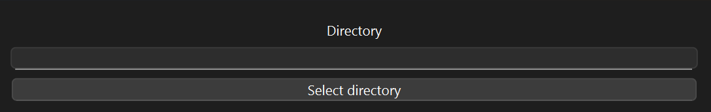
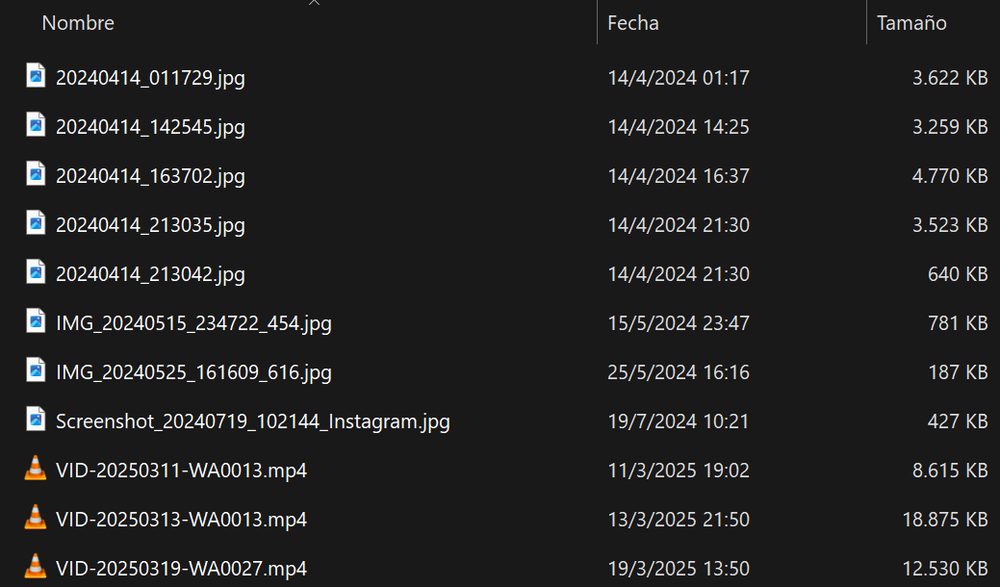
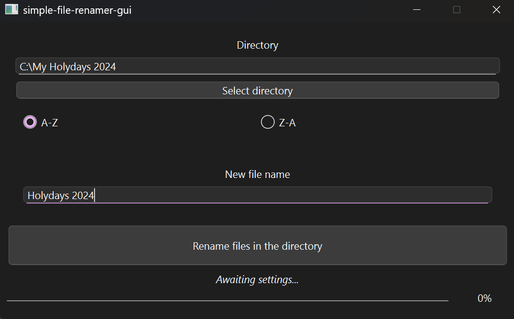
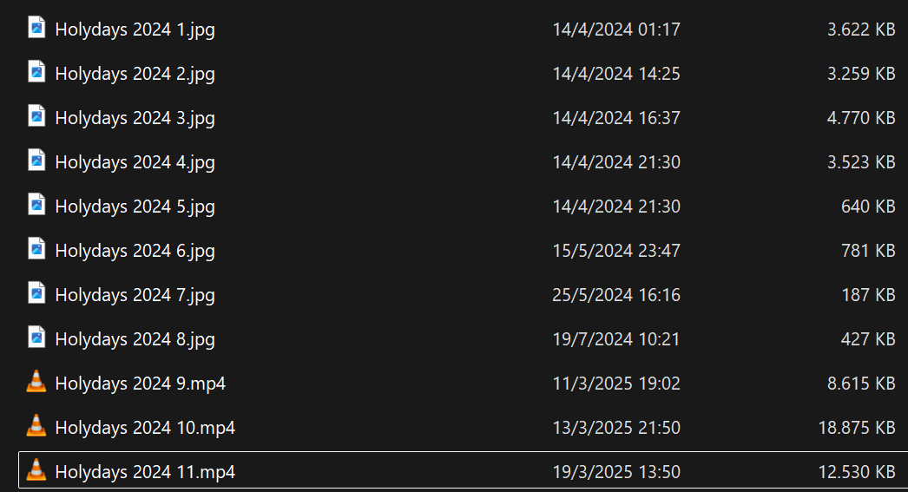

# simple-file-renamer-gui, GUI tool for renaming files in a directory
## How to use
1. Select the directory which has all the files you wish to rename

> [!CAUTION]
> Every file in the chosen directory will be renamed. Be sure that only files that you want to rename are in the directory before proceeding.

2. Choose in which order should the files in the directory be renamed

3. Type in the new name for the renamed files

After the filename, an autoincremental number will be added starting with the number 1

4. Press the button to rename your files!

## Use example

### Directory to be chosen for renaming

### simple-tv-showrenammer settings

### Directory after renaming the files

## Download

Go to the [Releases section](/releases).